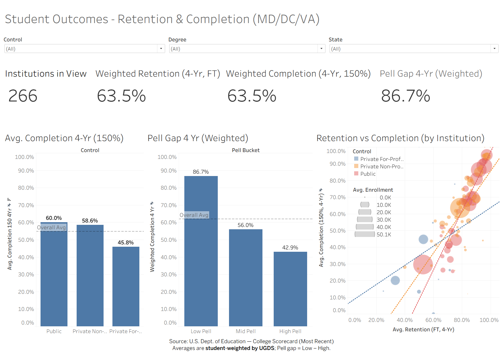
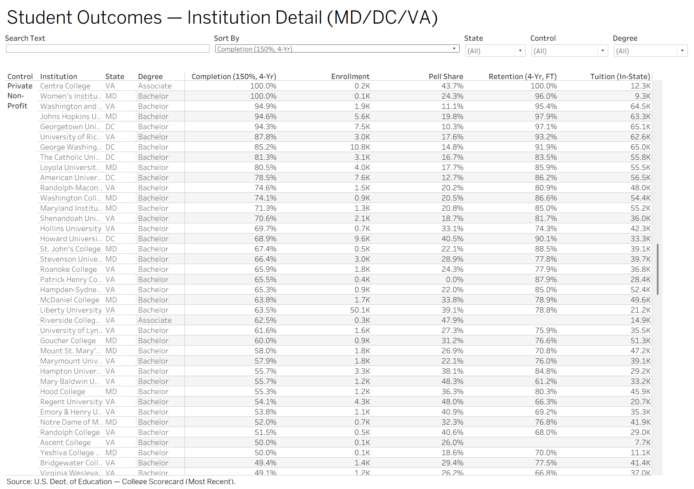

# Student Outcomes – Retention & Completion (MD/DC/VA)

This project demonstrates a compact, reproducible workflow to ingest public higher-education data, prepare student-weighted metrics, and publish stakeholder-ready Tableau dashboards. 


**Tech stack:** Python 3.11 (pandas, numpy) • Docker • GitHub Actions (CI) • Tableau • R + rmarkdown (one-pager) • T-SQL/SQL Server • Git


---

## Dashboards

**Overview** – weighted KPIs and comparisons  



**Institution Detail** – searchable, sortable table  



---

## Repository Structure

```
student-outcomes-reporting/
├─ data/
│  ├─ raw/
│  │  └─ Most-Recent-Cohorts-Institution_05192025.csv
│  └─ scorecard_subset.csv
├─ reports/
│  └─ one_pager.Rmd
├─ sql/
│  ├─ create_scorecard_table.sql
│  ├─ examples_tsql_queries.sql
│  └─ views_retention_completion.sql
├─ src/
│  ├─ prepare_scorecard.py
│  └─ validate_subset.py
├─ tableau/
│  ├─ screenshots/
│  │  ├─ overview.png
│  │  └─ detail_table.png
│  └─ student_outcomes.twbx
├─ .dockerignore
├─ .gitignore
├─ Dockerfile
├─ requirements.txt
└─ README.md
```

---

## Quickstart

### 1) Build the container
```bash
docker build -t student-outcomes-reporting .
```

### 2) Generate the Tableau-ready CSV

**macOS / Linux / Git Bash / WSL**
```bash
docker run --rm   --mount type=bind,src="$(pwd)"/data,dst=/work/data   student-outcomes-reporting   --input data/raw/Most-Recent-Cohorts-Institution_05192025.csv   --states MD DC VA   --output data/scorecard_subset.csv
```

## Data Dictionary (subset)

| Column                    | Description                                        |
|--------------------------|----------------------------------------------------|
| `INSTNM`                 | Institution name                                   |
| `STABBR`                 | State (postal)                                     |
| `PREDDEG`                | Highest degree level (Associate/Bachelor/…)        |
| `UGDS`                   | Undergraduate enrollment (count)                   |
| `PELL_SHARE`             | % of students receiving Pell grants                |
| `RETENTION_FT_4YR`       | 4-year full-time retention rate (proportion)       |
| `COMPLETION_150_4YR`     | 4-year completion at 150% time (proportion)        |
| `TUITIONFEE_IN`          | In-state tuition (USD)                             |

*Weighted KPIs use UGDS as weights; Pell gap = Low-Pell weighted completion − High-Pell weighted completion.*


**Windows CMD (no WSL)**
```cmd
docker run --rm ^
  --mount type=bind,src="%cd%\data",dst=/work/data ^
  student-outcomes-reporting ^
  --input data/raw/Most-Recent-Cohorts-Institution_05192025.csv ^
  --states MD DC VA ^
  --output data/scorecard_subset.csv
```

What the step does:
- Reads the most-recent institution-level College Scorecard CSV.
- Keeps MD, DC, VA and the fields used by the dashboards.
- Converts proportions to percentages and normalizes labels.
- Writes `data/scorecard_subset.csv` for Tableau.

> If column names change upstream, the script auto-maps common variants and raises a clear warning when a required field is missing.

---

## Tableau

Open `tableau/student_outcomes.twbx`.

### Overview
- KPIs: Institutions in View, **Weighted Retention (4-Yr, FT)**, **Weighted Completion (4-Yr, 150%)**, **Pell Gap 4-Yr (Weighted)**.
- Bars: Completion by **Control** and by **Pell Bucket**.
- Scatter: **Retention vs Completion** by institution (size = **UGDS**, color = **Control**, trendlines by Control).
- Filter cards: State, Control, Degree.
- Filter actions wire drill-through to the Detail dashboard.

### Institution Detail
- Columns: `Institution | State | Degree | Completion (150%, 4-Yr) | Enrollment | Pell Share | Retention (4-Yr, FT) | Tuition (In-State)`.
- Controls (top row):
  - **Search** parameter (case-insensitive contains on Institution).
  - **Sort By** parameter (Completion / Retention / Pell Share / Enrollment / Tuition) backed by a calculated Sort Key.
  - Filters: State, Control, Degree (scoped to the table only).
- Formatting: one-decimal percentages; Enrollment/Tuition with thousands separators; light row banding; concise tooltip.

---

## Metric Definitions (Tableau)

**Student-weighted KPI (example: Completion 4-Yr, 150%)**
```
SUM([COMPLETION_150_4YR] * [UGDS]) / NULLIF(SUM([UGDS]), 0)
```

**Pell Buckets**
- Low / Mid / High by `PELL_SHARE` terciles.

**Pell Gap (Weighted)**
```
Low_Weighted  = SUM( IIF([Pell Bucket]="Low Pell",  [COMPLETION_150_4YR]*[UGDS], NULL) )
                 / NULLIF(SUM( IIF([Pell Bucket]="Low Pell",  [UGDS], NULL) ), 0)

High_Weighted = SUM( IIF([Pell Bucket]="High Pell", [COMPLETION_150_4YR]*[UGDS], NULL) )
                 / NULLIF(SUM( IIF([Pell Bucket]="High Pell", [UGDS], NULL) ), 0)

Pell Gap 4-Yr (Weighted) = [Low_Weighted] - [High_Weighted]
```

---

## SQL (T-SQL)

- `sql/create_scorecard_table.sql` – table for loading `scorecard_subset.csv`.
- `sql/views_retention_completion.sql` – views for retention/completion and student-weighted KPIs.
- `sql/examples_tsql_queries.sql` – sample queries for Completion by Control, Pell buckets, and KPI rollups.

This mirrors the Tableau logic in SQL Server for parity and auditability.

---

## Data Source and Notes

- Source: U.S. Dept. of Education — College Scorecard (Most Recent, institution level).
- Geography: MD, DC, VA for a focused example.
- KPI weighting: student-weighted by `UGDS`. Institution table shows raw values.
- Caveats: public data may change over time; the prep step validates required columns and types.

_Data freshness:_ this repo uses the “Most Recent Cohorts (Institution)” CSV; replace the file in `data/raw/` when the College Scorecard site posts a new release.

---

## Skills Presented

- Repeatable **data collection and archiving** (Dockerized prep).
- **Analytical design** of metrics and comparisons (weighted KPIs, Pell gap).
- **Visualization and communication** for technical and non-technical audiences.
- **T-SQL** examples for reporting parity in SQL Server.
- Clear, concise documentation and a one-pager template for stakeholders.


---

## License and Attribution

- Code and dashboards © 2025 Chih-Hao Huang.
- Data © U.S. Dept. of Education — College Scorecard. Review their terms for reuse.
